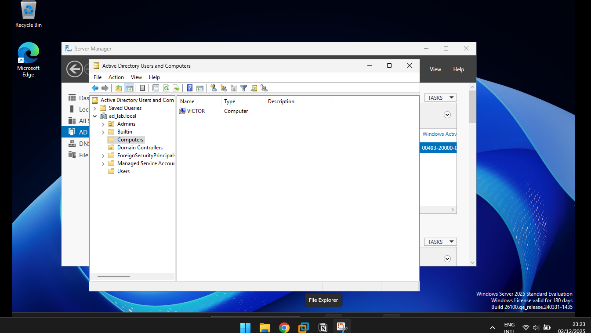
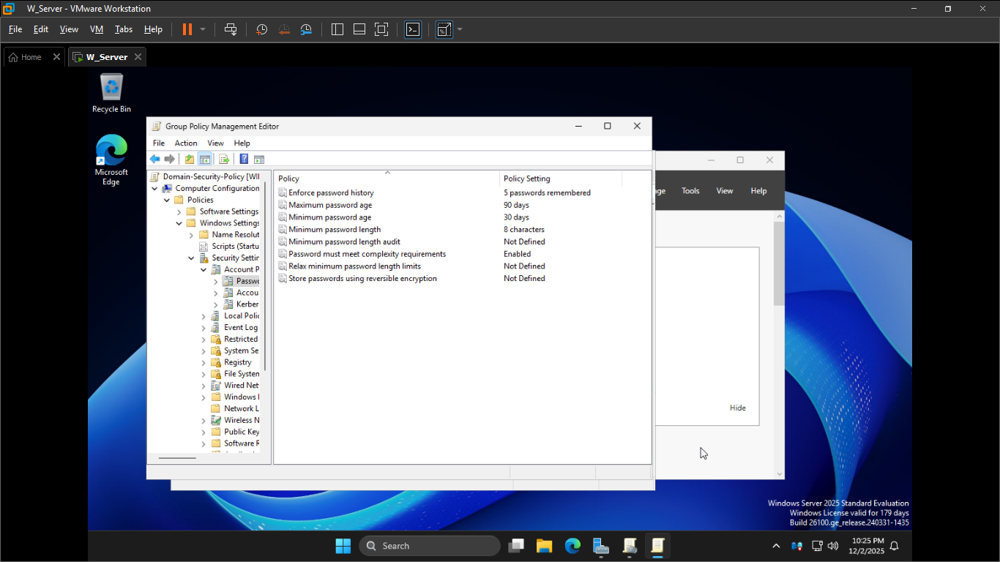
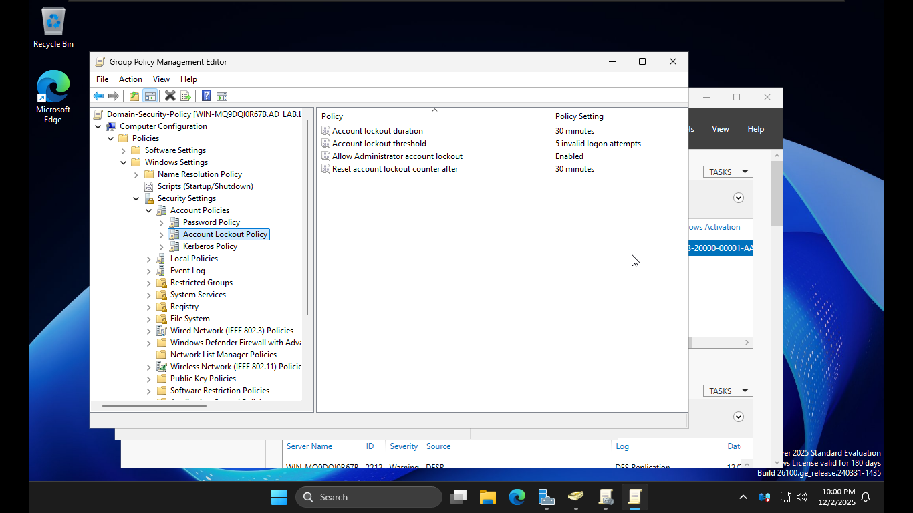
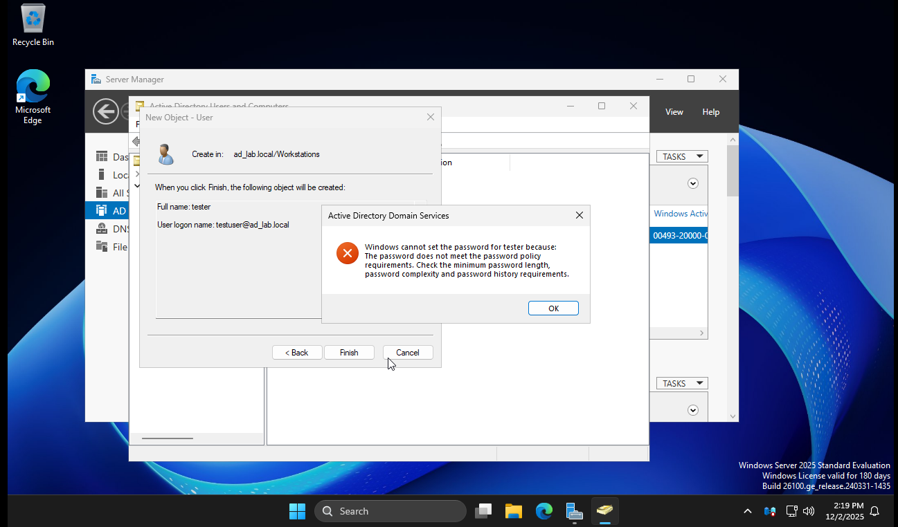
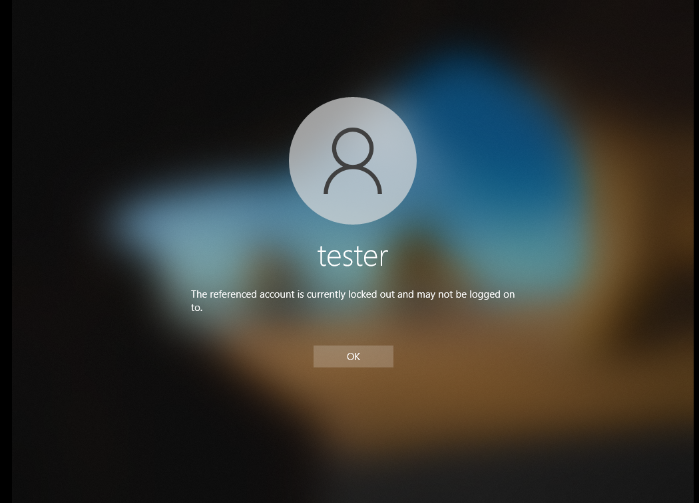

# Project Summary

Active Directory remains the identity backbone in roughly **90 percent** of enterprise networks, making baseline configuration and policy enforcement one of the highest-value skills across IT and security roles. This lab sets up a functional AD DS environment, joins a Windows client, builds a proper OU hierarchy, applies essential security Group Policy settings, and validates enforcement with real tests. The environment mirrors standard small-enterprise deployments used in operational IT.

## Environment Architecture

- **Domain Controller:** Windows Server 2025
- **Client:** Windows 10 22H2 (VMware Workstation)
- **Domain:** `ad_lab.local`
- **Network:** Internal LAN
- **Services Configured:** AD DS, DNS, GPO, Security Baselines

## Objectives

- Deploy Active Directory Domain Services
- Configure DNS automatically via DC promotion
- Build a clean, production-style OU structure
- Join a client system to the domain
- Apply security-relevant Group Policy Objects
- Validate password and lockout policies through live tests

## Implementation

###  1. Domain Controller Setup

- Installed AD DS role through Server Manager
- Promoted the server to a new forest: **ad_lab.local**
- Verified creation of all essential AD containers and DNS records
    - `_msdcs.ad_lab.local`
    - Host and SRV records

---

### 2. Domain Join (Windows 10 22H2)

- Ensured DNS pointed directly to the DC
- Confirmed time sync and Kerberos functionality

Client Connected Successfully

###  3. Security Group Policy Configuration

### **Password Policy**

Industry baselines show that enforcing password complexity and rotation reduces successful credential-based attacks by **30 to 40 percent** in SMB environments.

Configured:

- Minimum length: **8 characters**
- Complexity: **Enabled**
- Maximum password age: **90 days**
- Password history: **5**

Password Policy

---

### **Account Lockout Policy**

Account lockouts are historically tied to reducing brute-force success rates by **over 90 percent** at small scale.

Configured:

- Threshold: **5 attempts**
- Duration: **30 minutes**
- Reset counter: **30 minutes**

Account Lockout Policy

### 4. Enforcement Testing

- Attempted weak passwords → blocked
- Entered invalid credentials 5 times → account locked
- Confirmed GPO hits with `gpresult /r`

Password Complexity Test

Lockout Policy

## Skills Demonstrated

- Identity and Access Management
- GPO and baseline security configuration
- Windows Server administration
- Enterprise-style directory structuring
- Policy validation and troubleshooting
